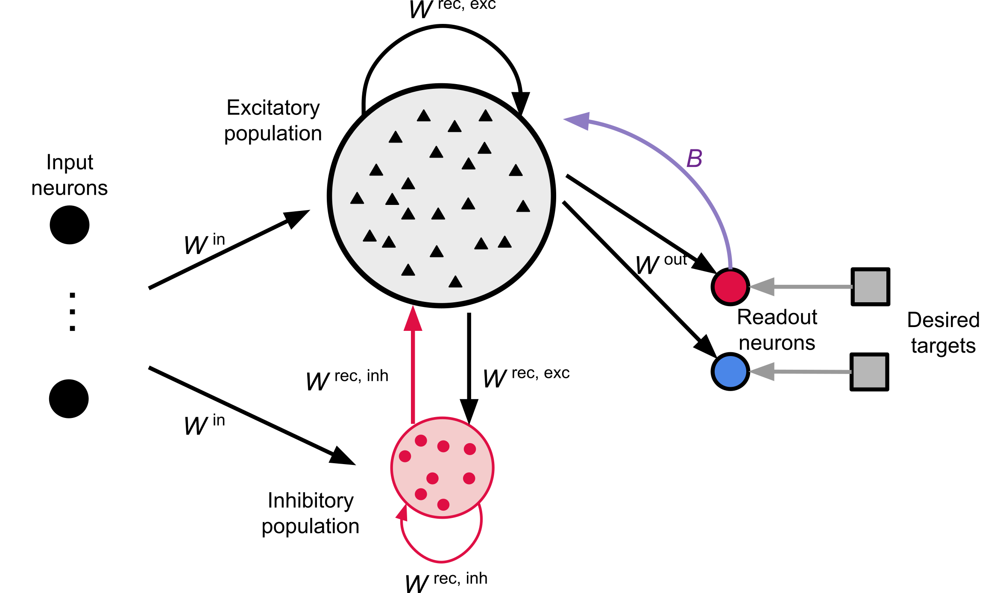

# Motor Controller Spiking Neural Network (SNN) Model with e-prop

This repository contains code, data, and neuron models for simulating and analyzing motor control experiments using spiking neural networks and the e-prop (eligibility propagation) learning algorithm. The network models motor cortex (M1) activity for a movement task, using e-prop learning as implemented in NEST.

<p align="center">
   
</p>

**Figure 1. Schematic of the spiking neural network (SNN) architecture for motor control.**  
On the left, labeled "input neurons," time-varying joint angles are received as external signals. These signals are projected into a central recurrent network (reservoir), which models the motor cortex (M1). Within the reservoir, black triangles represent individual excitatory spiking neurons, while the red circle at the bottom denotes the inhibitory neuron population—crucial for dynamically balancing network activity via recurrent inhibition.  
The recurrent network outputs to two readout neurons via e-prop synapses: a red circle ("pos" channel) and a blue circle ("neg" channel), each corresponding to a motor output direction. Gray arrows from these readout neurons point to target signals, illustrating supervised learning via error comparison. The purple arrow labeled "B" represents the feedback path by which the readout neurons send the e-prop learning signal (global error signal) back to the recurrent network, enabling biologically plausible online synaptic adaptation.  
Colors and shapes explicitly encode network roles: labeled input neurons (left), excitatory reservoir neurons (black triangles), inhibitory population (red circle), and output channels (red and blue circles).


## Repository Structure

- [`src/motor_controller_model/`](src/motor_controller_model/) — Main package containing all code for running motor control experiments, training spiking networks, analyzing results, and visualizing outputs. See its [README](src/motor_controller_model/README.md) for detailed usage and options.
- [`src/motor_controller_model/dataset_motor_training/`](src/motor_controller_model/dataset_motor_training/) — Contains trajectory data, spike datasets, and utilities for dataset handling. Includes a [README](src/motor_controller_model/dataset_motor_training/README.md) describing the dataset format.
- [`src/motor_controller_model/nestml_neurons/`](src/motor_controller_model/nestml_neurons/) — NESTML neuron model files and scripts for compiling custom neuron modules. See its [README](src/motor_controller_model/nestml_neurons/README.md) for details.
- `results/` — Output directory for simulation results, plots, and data (created automatically). Curated reference runs are kept under `results/legacy_sequence/` and `results/sample_good_results/`.
- [`pyproject.toml`](pyproject.toml) — Python package configuration and pip dependencies.
- [`environment.yml`](environment.yml) — Conda/mamba environment specification including `nest-simulator` and build tools (CMake, Boost, GSL).

## Getting Started

### 1. Install the package

**Inside the Docker container (NEST is pre-installed)**

```bash
pip install -e ".[standalone]"
```

**Standalone / local development**

`nest-simulator` is a compiled dependency that cannot be installed via pip. Start with conda/mamba, then install the package:

```bash
mamba env create -f environment.yml
mamba activate motor-controller
pip install -e ".[standalone]"
```

### 2. Compile NESTML Neurons

```bash
python -m motor_controller_model.nestml_neurons.compile_nestml_neurons
```

### 3. Quick Start

Train the M1 network and run a standalone inference test:
```bash
python -m motor_controller_model.run_m1 --force-retrain \
    --nest-module "./src/motor_controller_model/nestml_neurons/nestml_install/motor_neuron_module.so"
```

When running inside the controller devcontainer, use the `custom_stdp_module` NEST module:
```bash
python -m motor_controller_model.run_m1 --output-dir /sim/controller/artifacts/m1/ --force-retrain --nest-module=custom_stdp_module
```

This trains the network (or loads cached weights if config matches), then runs an inference test and saves results and plots to the output directory.

**For detailed usage, command-line options, and parameter sweeps**, see the [motor_controller_model README](src/motor_controller_model/README.md).

### 4. Additional Resources

- **Network Architecture:** See [`overview_network.png`](overview_network.png) for a visual summary of the spiking neural network architecture (Figure 1 above)
- **Package Documentation:** See [`src/motor_controller_model/README.md`](src/motor_controller_model/README.md) for detailed API usage
- **Outdated files:** Legacy scripts, tutorials, and the monolithic training script are in [`outdated/`](outdated/).


## License
<Specify your license here>
